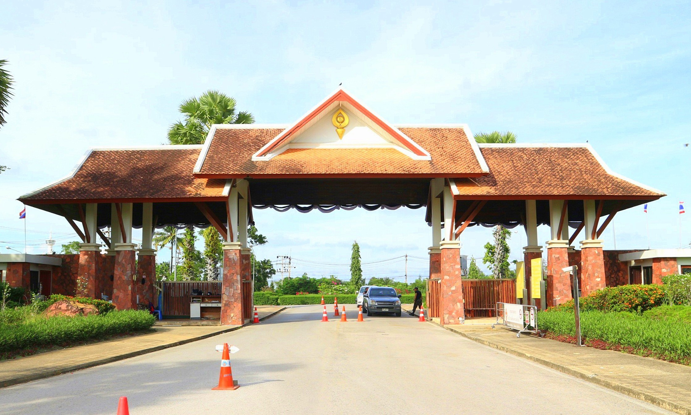
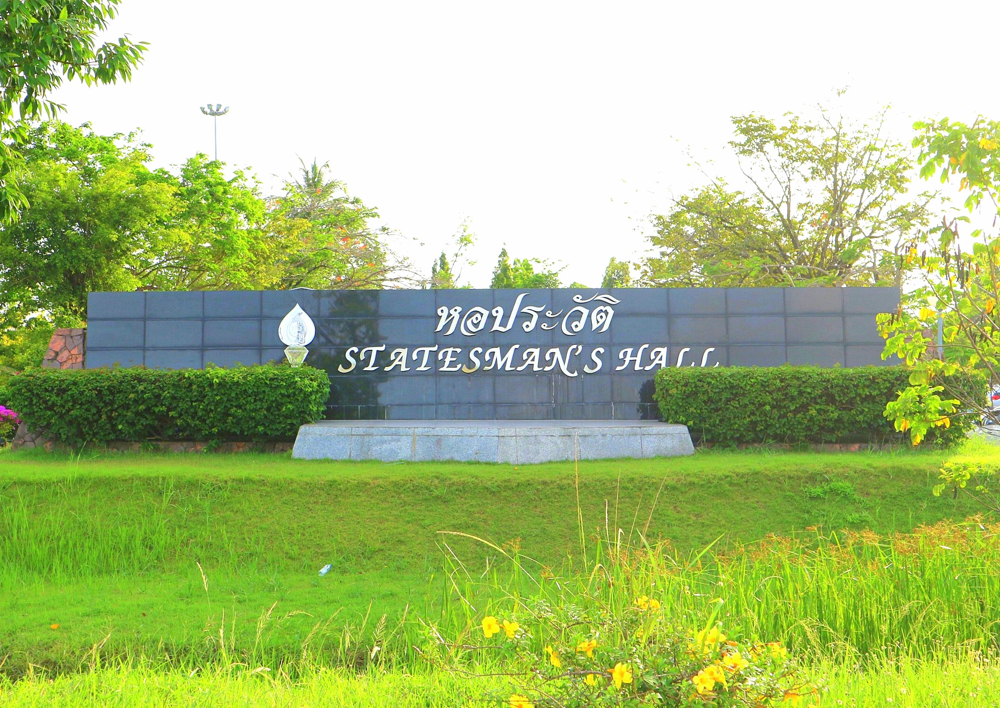
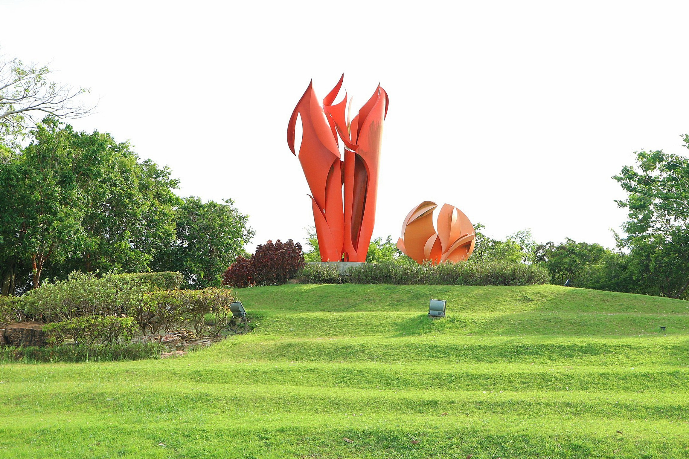
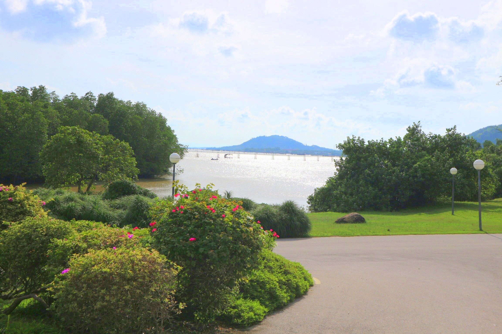
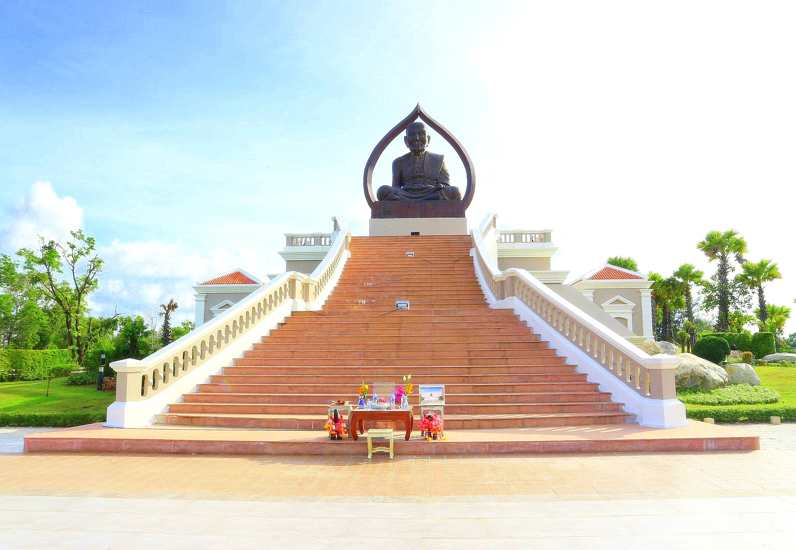
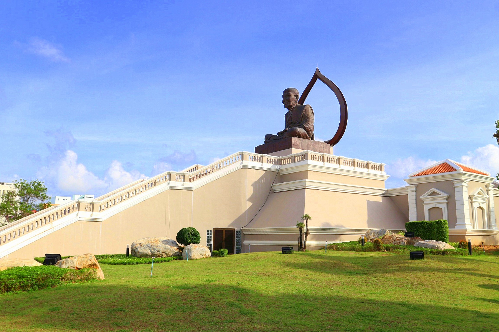
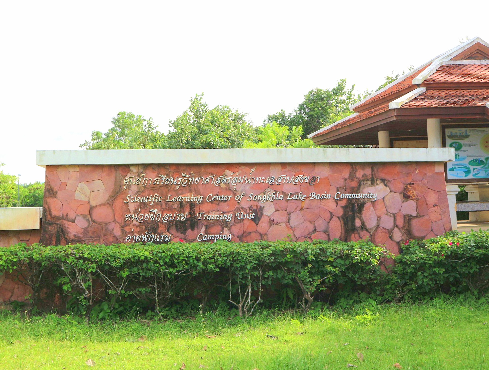
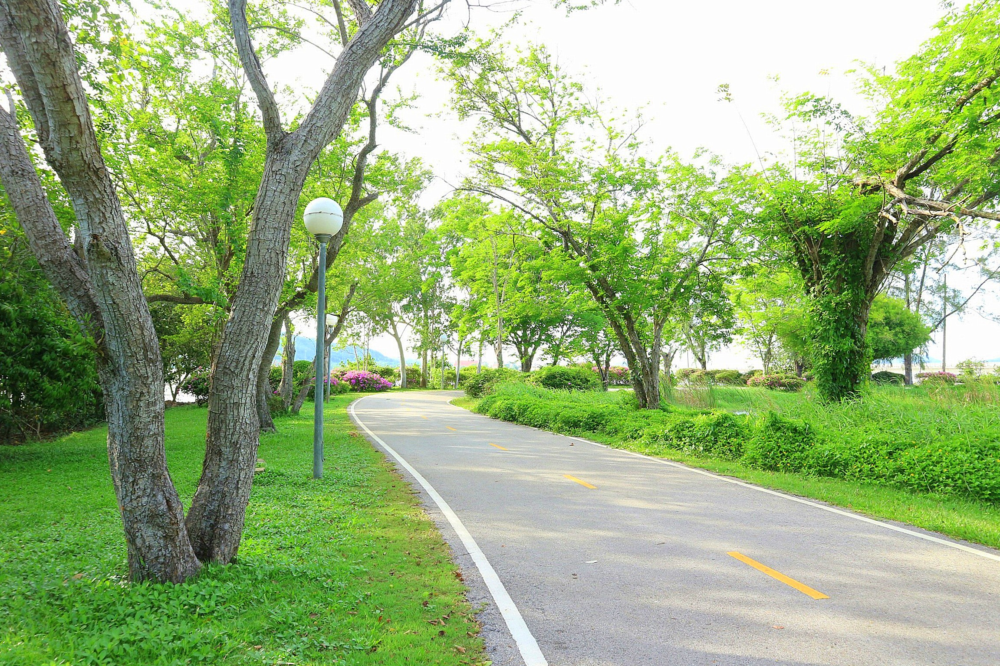
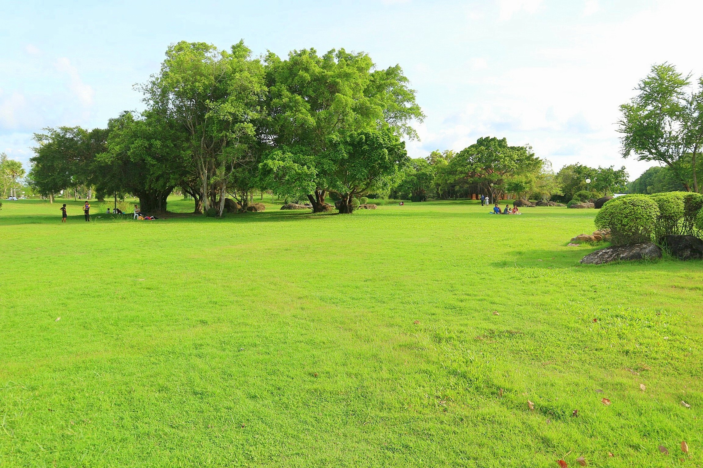

<!DOCTYPE html>
<html>
<title>สวนประวัติศาสตร์</title>
<meta charset="UTF-8">
<meta name="viewport" content="width=device-width, initial-scale=1">
<link rel="stylesheet" href="https://www.w3schools.com/w3css/4/w3.css">
<link rel="stylesheet" href="https://cdnjs.cloudflare.com/ajax/libs/font-awesome/4.7.0/css/font-awesome.min.css">

<body>

  <!-- Navbar (sit on top) -->

  

    <a href="#home" class="w3-bar-item w3-button"><i class="fa fa-bicycle"></i> <b>Songkhla</b>  Go Go</a>
    <!-- Search box -->
    

        <input type="text" name="search" placeholder=" ค้นหาสถานที่.." class="w3-border w3-round"> <i class="fa fa-search"></i>
    

    <!-- Float links to the right. Hide them on small screens -->
    

      <!--list of places -->
        

        <button class="w3-bar-item w3-button w3-yellow">Travel Places <i class="fa fa-angle-down"></i></button>
        

          <a href="#" class="w3-bar-item w3-button">วัดเขาเก้าแสน</a>
          <a href="#" class="w3-bar-item w3-button">แหลมสมิหลา</a>
          <a href="#" class="w3-bar-item w3-button">แหลมสนอ่อน หัวพญานาค</a>
          <a href="#" class="w3-bar-item w3-button">กรมหลวงชุมพร</a>
          <a href="#" class="w3-bar-item w3-button">เขาตังกวน</a>
          <a href="#" class="w3-bar-item w3-button">ถนนนางงาม</a>
          <a href="#" class="w3-bar-item w3-button">ถนนคนเดิน</a>
          <a href="#" class="w3-bar-item w3-button">สวนป๋าเปรม</a>
          <a href="#" class="w3-bar-item w3-button">วัดแหลมพ้อ</a>
  

      <a href="#about" class="w3-bar-item w3-button">About</a>
      <a href="#contact" class="w3-bar-item w3-button">Contact</a>
    

  

<!-- Header -->
<header class="w3-display-container w3-content w3-wide" style="max-width:1600px;min-width:500px" id="home">
  
  

  

</header>

<!-- Page content -->

  <!-- About Section -->
  

    

     
     

   

    

      <h1 class="w3-center">สวนประวัติศาสตร์</h1>
      <h2 class="w3-center">พลเอกเปรม ติณสูลานนท์</h2>
      <h3 class="w3-center">ประวัติและความเป็นมา</h3>
      
  สวนประวัติศาสตร์ พลเอกเปรม ติณสูลานนท์ตั้งอยู่บริเวณเชิงสะพานติณสูลานนท์ ตำบลพะวง อำเภอเมือง จังหวัดสงขลา เป็นสถานที่ที่ชาวสงขลาและผู้มีจิตศรัทธาในคุณความดี ความเสียสละของ  ฯพณฯ พลเอก เปรม  ติณสูลานนท์  ประธานองคมนตรีและรัฐบุรุษ  ร่วมมือกันจัดสร้างขึ้นเพื่อเชิดชูเกียรติ  โดยสร้างอาคารอเนกประสงค์  เพื่อเป็นสถานที่ประชุมสัมมนาระดับนานาชาติ  ปัจจุบันปรับปรุงเป็นหอประวัติ  พลเอกเปรม  ติณสูลานนท์  ปรับปรุงสภาพภูมิทัศน์โดยรอบบริเวณเป็นสวนสาธารณะ แหล่งเรียนรู้ป่าชายเลน  ค่ายพักแรม(Camping) เป็นสถานที่พักผ่อนหย่อนใจ และเป็นแหล่งท่องเที่ยวที่สำคัญแหล่งหนึ่งของจังหวัดสงขลา  

      
ที่มา : <a href="http://site2.generalprempark.com/th/2010-03-21-12-45-46.html" target="_blank">http://site2.generalprempark.com/th/2010-03-21-12-45-46.html</a>

      <h5 class="w3-center">ความประทับใจ</h5>
      

    

  

  

  <!-- Menu Section -->
  

    

      <h1 class="w3-center w3-card-2">ข้อมูลสถานที่</h1> 
      <h4>ที่ตั้ง</h4>
      
หมู่ 2 ตำบลพะวง อำเภอเมืองสงขลา จังหวัดสงขลา 90100
 

      <h4></h4>
      

      <h4>วันและเวลาทำการ</h4>
      
หอประวัติ

      
เปิดวันอังคาร-อาทิตย์(ปิดวันจันทร์)เวลา 9.30-16.30 น.

      
สวนสาธารณะ

      
เปิดทุกวัน 6.00-20.00 น.
 

      <h4>ค่าเข้าชม</h4>
      
หอประวัติศาสตร์ : ชาวไทย

      
ผู้ใหญ่  60 บาท

      
นักเรียน/นักศึกษา  20 บาท

      
ผู้สูงอายุ 30 บาท

    

    

      
       
      
    

  

<h1 class="w3-center w3-card-2">ภาพบรรยากาศ</h1> 
 
 
 
 
 
 
 

<!-- End page content -->

</body>
</html>
