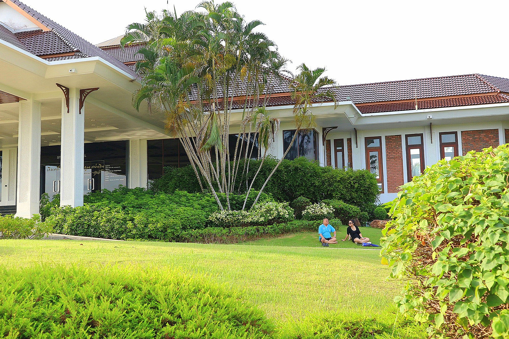
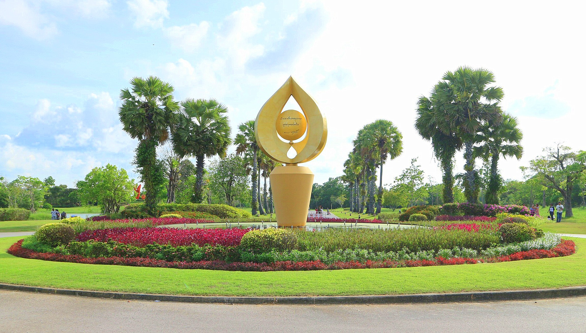

<!DOCTYPE html>
<html>
<title>W3.CSS Template</title>
<meta charset="UTF-8">
<meta name="viewport" content="width=device-width, initial-scale=1">
<link rel="stylesheet" href="https://www.w3schools.com/w3css/4/w3.css">
<link rel="stylesheet" href="https://cdnjs.cloudflare.com/ajax/libs/font-awesome/4.7.0/css/font-awesome.min.css">

<body>

<!-- Navbar (sit on top) -->

    

      <a href="#home" class="w3-bar-item w3-button"><i class="fa fa-bicycle"></i> <b>Songkhla</b>  Go Go</a>
      <!-- Search box -->
      

          <input type="text" name="search" placeholder=" ค้นหาสถานที่.." class="w3-border w3-round"> <i class="fa fa-search"></i>
      

      <!-- Float links to the right. Hide them on small screens -->
      

        <!--list of places -->
          

          <button class="w3-bar-item w3-button w3-yellow">Travel Places <i class="fa fa-angle-down"></i></button>
          

            <a href="#" class="w3-bar-item w3-button">วัดเขาเก้าแสน</a>
            <a href="#" class="w3-bar-item w3-button">แหลมสมิหลา</a>
            <a href="#" class="w3-bar-item w3-button">แหลมสนอ่อน หัวพญานาค</a>
            <a href="#" class="w3-bar-item w3-button">กรมหลวงชุมพร</a>
            <a href="#" class="w3-bar-item w3-button">เขาตังกวน</a>
            <a href="#" class="w3-bar-item w3-button">ถนนนางงาม</a>
            <a href="#" class="w3-bar-item w3-button">ถนนคนเดิน</a>
            <a href="#" class="w3-bar-item w3-button">สวนป๋าเปรม</a>
            <a href="#" class="w3-bar-item w3-button">วัดแหลมพ้อ</a>
    

  

        <a href="#about" class="w3-bar-item w3-button">About</a>
        <a href="#contact" class="w3-bar-item w3-button">Contact</a>
      

    

  

<!-- Header -->
<header class="w3-display-container w3-content w3-wide" style="max-width:1600px;min-width:500px" id="home">
  
  

  

</header>

<!-- Page content -->

  <!-- About Section -->
  

    

     
     

   

    

      <h1 class="w3-center">สวนประวัติศาสตร์</h1>
      <h2 class="w3-center">พลเอกเปรม ติณสูลานนท์</h2>

      
ประวัติความเป็นมา 
        สวนประวัติศาสตร์ พลเอกเปรม ติณสูลานนท์ตั้งอยู่บริเวณเชิงสะพานติณสูลานนท์ ตำบลพะวง อำเภอเมือง จังหวัดสงขลา  
 เป็นสถานที่ที่ชาวสงขลาและผู้มีจิตศรัทธาในคุณความดี  ความเสียสละของ  ฯพณฯ พลเอก เปรม  ติณสูลานนท์  ประธานองคมนตรีและรัฐบุรุษ  ร่วมมือกันจัดสร้างขึ้นเพื่อเชิดชูเกียรติ  โดยสร้างอาคารอเนกประสงค์  เพื่อเป็นสถานที่ประชุมสัมมนาระดับนานาชาติ  ปัจจุบันปรับปรุงเป็นหอประวัติ  พลเอกเปรม  ติณสูลานนท์  ปรับปรุงสภาพภูมิทัศน์โดยรอบบริเวณเป็นสวนสาธารณะ แหล่งเรียนรู้ป่าชายเลน  ค่ายพักแรม(Camping)  เป็นสถานที่พักผ่อนหย่อนใจ และเป็นแหล่งท่องเที่ยวที่สำคัญแหล่งหนึ่งของจังหวัดสงขลา  โดยนายบัญญัติ  จันทน์เสนะ ขณะดำรงตำแหน่งผู้ว่าราชการจังหวัดสงขลา พร้อมด้วยทีมงานทั้งภาครัฐ ภาคเอกชน และประชาชนเป็นศูนย์กลางความร่วมมือของผู้มีจิตศรัทธาในการก่อสร้าง สภาพปัจจุบันสวนประวัติศาสตร์พลเอกเปรม ติณสูลานนท์ มีพื้นที่ 140 ไร่ ตั้งอยู่ที่เชิงสะพานติณสูลานนท์ หมู่ที่ 2 ตำบลพะวง อำเภอเมืองสงขลา จังหวัดสงขลาแบ่งพื้นที่ตามรูปแบบของการใช้ประโยชน์เป็น  3 ส่วนด้วยกัน

    

  

  

  <!-- Menu Section -->
  

    

      <h1 class="w3-center w3-card-2">รายละเอียด</h1> 
      <h4>ที่อยู่และเบอร์ติดต่อ</h4>
      
หมู่ 2 ตำบลพะวง อำเภอเมืองสงขลา จังหวัดสงขลา 90100
Telephone : 074-334685
 

      <h4>วันและเวลาทำการ</h4>
      
หอประวัติฯ เปิดวันอังคาร-อาทิตย์(ปิดวันจันทร์)เวลา 9.30-16.30 น.
สวนสาธารณะ เปิดทุกวัน 6.00-20.00 น.
 

      <h4>ที่ตั้ง</h4>
      
 888 หมู่2 ต.พะวง อ.เมือง จ.สงขลา 90100
 

      <h4>ค่าเข้าชม</h4>
      
หอประวัติฯ :ชาวไทย
ผู้ใหญ่          60 บาท
นักเรียน/นักศึกษา        20 บาท
ผู้สูงอายุ             30 บาท
 
 

      <h4>การเดินทาง</h4>
      
โดยรถยนต์

จากกรุงเทพฯ ใช้ทางหลวงหมายเลข 35 (ถนนพระราม 2 หรือถนนธนบุรี-ปากท่อ) ผ่านจังหวัดสมุทรสาคร สมุทรสงคราม อำเภอปากท่อ แล้วแยกซ้ายเข้าทางหลวงหมายเลข 4 (ถนนเพชรเกษม) ผ่านจังหวัดเพชรบุรี ประจวบคีรีขันธ์ จนถึงชุมพร แล้วใช้ทางหลวงหมายเลข 41 ผ่านจังหวัดสุราษฎร์ธานี อำเภอทุ่งสง จนถึงจังหวัดพัทลุง บรรจบกับทางหลวงหมายเลข 4 อีกครั้ง แล้วขับต่อไปจนถึงอำเภอหาดใหญ่ และจังหวัดสงขลา รวมระยะทางประมาณ 950 กิโลเมตร

จากนั้นเดินทางต่อไปอีก 11.6 กม.ผ่าน ถนนหมายเลข 407 เลี้ยวขวา เข้าสู่ ถนนหมายเลข 408 2.6 กม. แล้วเลี้ยวซ้าย

    

    

      
       
      
    

  

<h1 class="w3-center w3-card-2">Our Menu</h1> 
 
 
 
 
 
 

 

<!-- End page content -->

</body>
</html>
